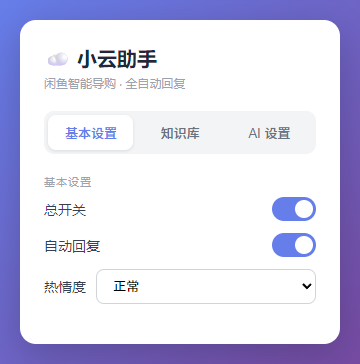
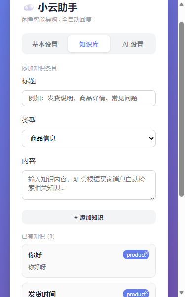
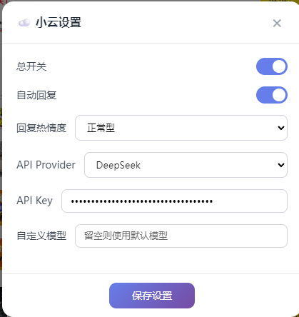
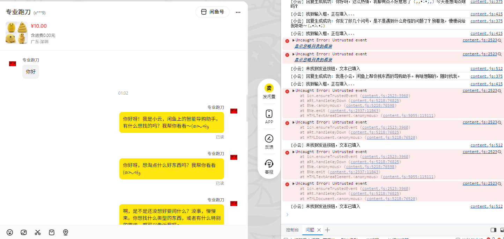

# ☁️ 小云 — 闲鱼智能导购助手

> AI 驱动的闲鱼自动回复 Chrome 扩展，从 0 到 1 独立完成的产品设计 + 工程实现

<div align="center">

| 属性 | 内容 |
|------|------|
| **产品形态** | Chrome 浏览器扩展（Manifest V3） |
| **目标平台** | 闲鱼 / Goofish（www.goofish.com） |
| **版本** | **v1.0.0** |
| **作者** | 孙一凡 |
| **协议** | [MIT](./LICENSE) |

</div>

---

## 🌟 项目简介

一款面向闲鱼卖家的**轻量化 AI 客服 Chrome 扩展**。安装后自动在闲鱼页面注入悬浮入口，当买家发送咨询消息时，小云基于商品信息 + 自定义知识库，以人格化的语气自动回复。

**核心差异化：** 不做冰冷的 FAQ 机器。小云有温度、有性格——像一位靠谱的二手交易老手，自然地帮买家解答问题。

## ✨ 功能特性

| 功能 | 说明 |
|------|------|
| ☁️ **悬浮入口** | 在闲鱼页面注入"小云在线"按钮，点击展开设置面板 |
| 🤖 **AI 自动回复** | 检测买家消息后自动调用 LLM 生成回复并发送 |
| 🧠 **人格化对话** | 两句话固定回复 + 颜文字情绪匹配 + 热情度可调 |
| 📚 **知识库 RAG** | BM25 关键词检索，卖家自定义知识条目，AI 基于知识回答 |
| 💬 **会话管理** | 多买家独立会话，保留最近 8 轮历史上下文 |
| 🔌 **多 Provider** | 支持 DeepSeek / OpenAI / Anthropic / 智谱 GLM / Ollama |
| 📦 **开箱即用** | 即装即用，无需注册账号，API Key 本地存储 |

## 📸 产品截图

| 悬浮按钮 | 设置面板 |
|---------|---------|
|  |  |

| 知识库管理 | 自动回复演示 |
|-----------|-------------|
|  |  |

> 📄 完整 PRD 文档见 [docs/](./docs/) 目录

## 🚀 快速开始

### 安装步骤

1. **下载扩展代码**
   ```bash
   git clone https://github.com/your-username/xiaoyun-xianyu.git
   cd xiaoyun-xianyu/extension
   ```

2. **加载到浏览器**
   - 打开 Chrome/Edge → `chrome://extensions/`
   - 开启「开发者模式」
   - 点击「加载已解压的扩展程序」
   - 选择 `extension/` 目录

3. **配置 API**
   - 点击扩展图标打开设置面板
   - 选择 Provider（默认 DeepSeek）
   - 填入 API Key
   - 点击「测试连接」验证
   - 点击「保存设置」

4. **开始使用**
   - 打开闲鱼聊天页面
   - 点击页面右下角"小云在线"按钮启用
   - 当买家发消息时，小云自动回复

### 环境要求

- Chrome 112+ / Edge 112+
- Manifest V3 支持

## 🏗️ 项目结构

```
extension/
├── manifest.json          # 扩展配置文件 (Manifest V3)
├── background.js          # Service Worker：配置管理、RAG 检索、LLM 调用
├── content.js             # 内容脚本：UI 注入、消息监听、自动回复
├── xiaoyun-ui.js          # UI 组件库：悬浮按钮、设置面板、弹窗样式
├── xiaoyun-ui.css         # 备用 CSS（JS 注入失败时使用）
├── popup.html             # 弹出窗口：Tab 导航设置面板
├── popup.js               # 弹出窗口交互逻辑
├── icons/                 # 扩展图标
│   ├── icon16.png
│   ├── icon48.png
│   └── icon128.png
├── generate-icons.html    # 图标生成工具
└── .gitignore
```

## ⚙️ 技术架构

### 扩展架构

```
┌─────────────────────────────────────────┐
│           Chrome Extension               │
│                                          │
│  ┌──────────────┐    ┌───────────────┐  │
│  │  Popup UI    │    │ Background SW │  │
│  │  (popup.html)│    │ · 配置管理    │  │
│  │  · 基本设置  │    │ · 商品上下文  │  │
│  │  · 知识库    │    │ · 会话管理    │  │
│  │  · AI 设置   │    │ · RAG 检索    │  │
│  └──────────────┘    │ · LLM 调用    │  │
│        ↕ RPC          └───────┬───────┘  │
│                                │           │
│  ┌─────────────────────────────┼─────────┐│
│  │         Content Script      │         ││
│  │  · 悬浮按钮 · 设置面板       │         ││
│  │  · 商品检测 · 消息监听       │         ││
│  │  · AI 回复 → 填入 → 发送    │         ││
│  │  · 自动滚动 + 高亮           │         ││
│  └─────────────────────────────┴─────────┘│
└─────────────────────────────────────────┘
            ↕ HTTPS
┌─────────────────────────────────────────┐
│         LLM API (DeepSeek/OpenAI/...)    │
└─────────────────────────────────────────┘
```

### 数据持久化

所有状态通过 `chrome.storage.local` 持久化：

| Key | 类型 | 内容 |
|-----|------|------|
| `xiaoyun_config` | Object | API Key、Provider、模型、开关、热情度 |
| `xiaoyun_product` | Object | 当前商品 ID、标题、价格、图片 |
| `xiaoyun_conversations` | Map | 多买家会话历史（最近 8 轮） |
| `xiaoyun_knowledge` | Array | 知识库条目列表 |

### 支持的 API Provider

| Provider | Base URL | 默认模型 |
|----------|----------|---------|
| 🔵 DeepSeek | `api.deepseek.com` | `deepseek-chat` |
| 🟠 OpenAI | `api.openai.com/v1` | `gpt-4o-mini` |
| 🟢 Agnes-AI | `apihub.agnes-ai.com` | `agnes-default` |
| 🟣 Anthropic | `api.anthropic.com` | `claude-3-haiku-20240307` |
| 🔷 智谱 GLM | `open.bigmodel.cn/api/paas/v4` | `glm-4-flash` |
| ⚪ Ollama | `localhost:11434/v1` | `qwen2.5:latest` |

## 🧠 AI 策略

### RAG 检索方案

采用轻量级 **BM25 关键词检索**，无需向量数据库：

1. 买家消息 → 提取中文双字关键词（去停用词）
2. 逐条计算知识条目匹配分（关键词出现 +20 分，字符重叠加权等）
3. 取 Top-3 → 拼入 System Prompt

> **为什么选 BM25？** MVP 阶段知识条目通常 <50 条，关键词匹配足够，零依赖、低延迟（<10ms）、零成本。

### Prompt 工程

- **System Prompt** = 人格指令 + 商品信息 + 知识库上下文 + 热情度调节
- **Temperature** = 0.8（平衡创造性与准确性）
- **Max Tokens** = 150（确保两句话、≤80 字）
- **回复规则**：固定两句话，每条最多 1 个颜文字，跳过无意义消息

### 幻觉控制

| 风险 | 策略 |
|------|------|
| AI 编造产品信息 | System Prompt 强制"拿不准就如实告知" |
| 关键信息出错 | 价格/库存从 storage 读取，不依赖 AI |
| 回复发散 | Max Tokens + Temperature 双重约束 |
| 检索不相关 | 分数低于阈值时静默忽略 |

## 📋 产品决策记录

| 决策点 | 选项 A | 选项 B | 最终选择 | 理由 |
|--------|--------|--------|---------|------|
| **产品形态** | Web SaaS | Chrome 扩展 | **Chrome 扩展** ✅ | 闲鱼是 SPA，扩展可直接注入 DOM，零跳转体验最优 |
| **部署方式** | 云端 SaaS | 本地扩展 | **本地扩展** ✅ | 闲鱼卖家不想注册账号，即装即用 |
| **LLM 架构** | 单一模型 | 多 Provider | **多 Provider** ✅ | 适配不同预算（免费 Ollama / 低价 DeepSeek） |
| **RAG 方案** | 向量数据库 | BM25 检索 | **BM25** ✅ | MVP 无需额外依赖，知识条目少关键词匹配足够 |

## 🛣️ 版本规划

| 版本 | 功能范围 | 状态 |
|------|---------|------|
| **v1.0** | 悬浮按钮 · 消息检测 · AI 自动回复 · 多 Provider · 知识库 RAG · 会话管理 · 自动滚动 | 🟢 已完成 |
| **v1.5** | 消息回复评分 · 商家后台看板 · 高意向客户识别 · 回复模板自定义 | 🟡 规划中 |
| **v2.0** | 多商家多店铺支持 · 数据统计 · 更多人格模板 · 移动端适配 | ⏸ 远期 |

## ⚠️ 风险与应对

| 风险 | 应对方案 |
|------|---------|
| AI 幻觉编造信息 | 知识库严格限制 + "拿不准如实告知" |
| 闲鱼 DOM 结构变更 | 多兜底选择器策略 + 快速更新 |
| Service Worker 休眠 | 全部状态持久化到 chrome.storage |
| API 调用失败/超时 | 30 秒超时降级 + 弹窗提示 |
| 重复回复消息 | Set 缓存已处理消息（最多 100 条） |

## 📄 文档

- [产品需求文档 (PRD)](./docs/PRD.md) — 完整产品设计与技术架构
- [角色设定](./docs/character.md) — 小云人格设定与颜文字库
- [竞品分析](./docs/competitive-analysis.md) — 市场竞品对比

## 📝 关于作者

本项目由 **孙一凡** 独立完成，从产品设计、PRD 撰写、竞品分析到工程实现全流程。

- 求职意向：AI 应用经理 / AI 产品经理
- 教育：西安交通工程学院 · 车辆工程 · 2022-2026

## 📄 许可证

本项目采用 [MIT License](./LICENSE) 开源。

---

> ⚠️ 本文档为个人作品集项目，不构成商业产品规划。
